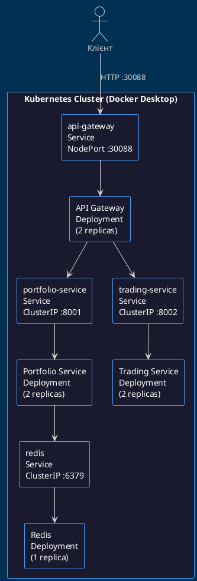
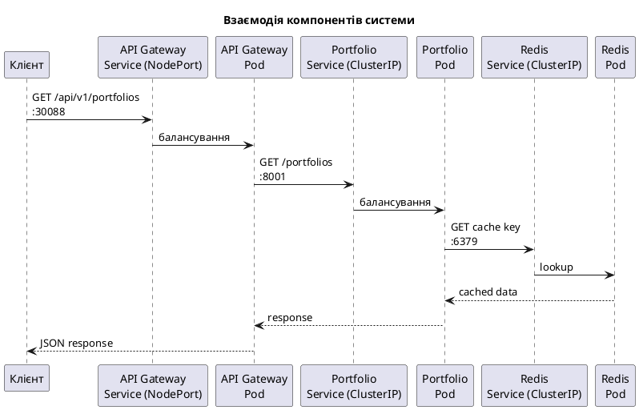
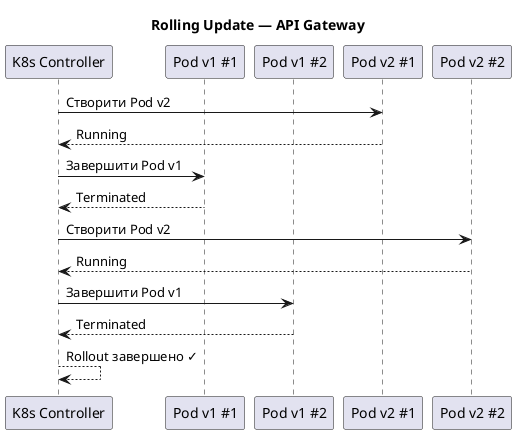
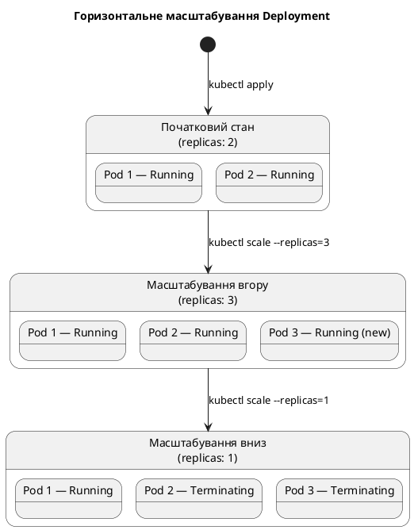

# Лабораторна робота №6
## Тема: Розгортання мікросервісного додатку у Kubernetes

**Студент:** _______________  
**Група:** _______________  
**Дата:** 2026

---

## 1. Мета роботи

Набути практичних навичок розгортання мікросервісного додатку у Kubernetes-кластері. Навчитися створювати Deployment та Service маніфести, масштабувати Pod-и, виконувати rolling update та порівнювати підходи Kubernetes і docker-compose.

---

## 2. Теоретичні відомості

### 2.1 Архітектура Kubernetes

**Kubernetes (K8s)** — відкрита система оркестрації контейнерів, розроблена Google. Автоматизує розгортання, масштабування та управління контейнеризованими застосунками.

Основні компоненти кластера:
- **Control Plane** — керуючий вузол: API Server, etcd, Scheduler, Controller Manager
- **Worker Nodes** — робочі вузли, де запускаються Pod-и
- **kubectl** — CLI-інструмент для взаємодії з кластером

### 2.2 Pod

**Pod** — найменша розгортувана одиниця в Kubernetes. Містить один або кілька контейнерів, які:
- Спільно використовують мережевий простір (один IP)
- Спільно використовують сховище (Volumes)
- Запускаються та зупиняються разом

Pod є ефемерним — при збої він замінюється новим автоматично.

### 2.3 Deployment

**Deployment** — ресурс K8s, що керує множиною ідентичних Pod-ів через ReplicaSet. Забезпечує:
- Підтримання заданої кількості реплік (`replicas`)
- Декларативні оновлення (rolling update / rollback)
- Автоматичне відновлення при збоях Pod-ів

### 2.4 Service

**Service** — абстракція, що надає стабільний мережевий endpoint для доступу до Pod-ів. Типи:

| Тип | Опис |
|-----|------|
| `ClusterIP` | Внутрішній IP, доступний лише всередині кластера (default) |
| `NodePort` | Відкриває порт на кожному вузлі кластера (30000–32767) |
| `LoadBalancer` | Зовнішній балансувальник (хмарні провайдери) |

### 2.5 Масштабування

Kubernetes підтримує горизонтальне масштабування — збільшення або зменшення кількості реплік Pod-ів командою `kubectl scale`. При масштабуванні вниз Pod-и завершуються gracefully, при масштабуванні вгору — нові Pod-и запускаються автоматично та реєструються у відповідному Service.

---

## 3. Постановка задачі

### 3.1 Які сервіси розгортаються

У рамках лабораторної роботи розгортається мікросервісний застосунок, що складається з чотирьох компонентів:

- **API Gateway** — точка входу для всіх зовнішніх запитів; маршрутизує трафік до Portfolio Service та Trading Service. Доступний через NodePort `:30088`.
- **Portfolio Service** — сервіс управління портфелями активів; використовує Redis для кешування. Доступний всередині кластера через ClusterIP.
- **Trading Service** — сервіс торгових операцій; взаємодіє з Portfolio Service. Доступний всередині кластера через ClusterIP.
- **Redis** — in-memory сховище даних для кешування та черг. Доступний всередині кластера через ClusterIP.

### 3.2 Які Deployment-и створюються

Для кожного сервісу створюється окремий Deployment-ресурс:

| Deployment | Образ | Початкові репліки | Порт |
|-----------|-------|-------------------|------|
| `api-gateway` | `api-gateway:latest` | 2 | 8000 |
| `portfolio-service` | `portfolio-service:latest` | 2 | 8001 |
| `trading-service` | `trading-service:latest` | 2 | 8002 |
| `redis` | `redis:alpine` | 1 | 6379 |

Кожен Deployment налаштований з `imagePullPolicy: Never` (використання локальних образів) та має відповідний Service для мережевого доступу.

### 3.3 Яке масштабування реалізується

Реалізується горизонтальне масштабування вручну через команду `kubectl scale`:
- **Масштабування вгору** — збільшення реплік API Gateway і Portfolio Service з 2 до 3
- **Масштабування вниз** — зменшення реплік до 1
- **Спостереження** — перевірка стану Pod-ів під час масштабування через `kubectl get pods`

Також реалізується **Rolling Update** — оновлення образу без зупинки сервісу, з можливістю відкату (`kubectl rollout undo`).

---

## 4. Проектування

### 4.1 Схема кластера



### 4.2 Взаємодія компонентів

Взаємодія між компонентами відбувається виключно через Kubernetes Service-и, що забезпечує абстракцію від конкретних IP-адрес Pod-ів:



### 4.3 Структура YAML-файлів

Всі маніфести розміщено у директорії `k8s/` і розділено за типами ресурсів:

```
k8s/
├── api-gateway-deployment.yaml     # Deployment для API Gateway
├── api-gateway-service.yaml        # Service (NodePort) для API Gateway
├── portfolio-deployment.yaml       # Deployment для Portfolio Service
├── portfolio-service.yaml          # Service (ClusterIP) для Portfolio Service
├── trading-deployment.yaml         # Deployment для Trading Service
├── trading-service.yaml            # Service (ClusterIP) для Trading Service
├── redis-deployment.yaml           # Deployment для Redis
└── redis-service.yaml              # Service (ClusterIP) для Redis
```

Кожен файл містить два ресурси або є окремим маніфестом, що відповідає принципу єдиної відповідальності. Застосування всіх маніфестів виконується одноразово через `kubectl apply -f k8s/`.

---

## 5. Реалізація

### 5.1 Deployment YAML

#### API Gateway

Файл: `k8s/api-gateway-deployment.yaml`

```yaml
apiVersion: apps/v1
kind: Deployment
metadata:
  name: api-gateway
  labels:
    app: api-gateway
spec:
  replicas: 2
  selector:
    matchLabels:
      app: api-gateway
  strategy:
    type: RollingUpdate
    rollingUpdate:
      maxSurge: 1
      maxUnavailable: 0
  template:
    metadata:
      labels:
        app: api-gateway
    spec:
      containers:
      - name: api-gateway
        image: api-gateway:latest
        imagePullPolicy: Never
        ports:
        - containerPort: 8000
        env:
        - name: PORTFOLIO_SERVICE_URL
          value: "http://portfolio-service:8001"
        - name: TRADING_SERVICE_URL
          value: "http://trading-service:8002"
```

#### Portfolio Service

Файл: `k8s/portfolio-deployment.yaml`

```yaml
apiVersion: apps/v1
kind: Deployment
metadata:
  name: portfolio-service
  labels:
    app: portfolio-service
spec:
  replicas: 2
  selector:
    matchLabels:
      app: portfolio-service
  template:
    metadata:
      labels:
        app: portfolio-service
    spec:
      containers:
      - name: portfolio-service
        image: portfolio-service:latest
        imagePullPolicy: Never
        ports:
        - containerPort: 8001
        env:
        - name: REDIS_URL
          value: "redis://redis:6379"
```

#### Trading Service

Файл: `k8s/trading-deployment.yaml`

```yaml
apiVersion: apps/v1
kind: Deployment
metadata:
  name: trading-service
  labels:
    app: trading-service
spec:
  replicas: 2
  selector:
    matchLabels:
      app: trading-service
  template:
    metadata:
      labels:
        app: trading-service
    spec:
      containers:
      - name: trading-service
        image: trading-service:latest
        imagePullPolicy: Never
        ports:
        - containerPort: 8002
        env:
        - name: PORTFOLIO_SERVICE_URL
          value: "http://portfolio-service:8001"
```

#### Redis

Файл: `k8s/redis-deployment.yaml`

```yaml
apiVersion: apps/v1
kind: Deployment
metadata:
  name: redis
  labels:
    app: redis
spec:
  replicas: 1
  selector:
    matchLabels:
      app: redis
  template:
    metadata:
      labels:
        app: redis
    spec:
      containers:
      - name: redis
        image: redis:alpine
        ports:
        - containerPort: 6379
```

### 5.2 Service YAML

#### API Gateway Service (NodePort)

```yaml
apiVersion: v1
kind: Service
metadata:
  name: api-gateway
spec:
  type: NodePort
  selector:
    app: api-gateway
  ports:
    - protocol: TCP
      port: 8888
      targetPort: 8000
      nodePort: 30088
```

#### Portfolio, Trading, Redis Services (ClusterIP)

```yaml
# portfolio-service.yaml
apiVersion: v1
kind: Service
metadata:
  name: portfolio-service
spec:
  selector:
    app: portfolio-service
  ports:
    - protocol: TCP
      port: 8001
      targetPort: 8001
---
# trading-service.yaml
apiVersion: v1
kind: Service
metadata:
  name: trading-service
spec:
  selector:
    app: trading-service
  ports:
    - protocol: TCP
      port: 8002
      targetPort: 8002
---
# redis-service.yaml
apiVersion: v1
kind: Service
metadata:
  name: redis
spec:
  selector:
    app: redis
  ports:
    - protocol: TCP
      port: 6379
      targetPort: 6379
```

### 5.3 Команди kubectl

**Підготовка — збірка образів:**
```bash
docker compose build
docker tag lab-complex-pd-api-gateway:latest api-gateway:latest
docker tag lab-complex-pd-portfolio-service:latest portfolio-service:latest
docker tag lab-complex-pd-trading-service:latest trading-service:latest
```

**Розгортання всіх ресурсів:**
```bash
kubectl apply -f k8s/
```

**Перевірка стану:**
```bash
kubectl get pods
kubectl get services
kubectl get deployments
```

*Вивід `kubectl get pods`:*
```
NAME                                 READY   STATUS    RESTARTS   AGE
api-gateway-xxxxxxxxx-xxxxx          1/1     Running   0          30s
api-gateway-xxxxxxxxx-yyyyy          1/1     Running   0          30s
portfolio-service-xxxxxxxxx-aaaaa    1/1     Running   0          35s
portfolio-service-xxxxxxxxx-bbbbb    1/1     Running   0          35s
redis-xxxxxxxxx-zzzzz                1/1     Running   0          40s
trading-service-xxxxxxxxx-ccccc      1/1     Running   0          32s
trading-service-xxxxxxxxx-ddddd      1/1     Running   0          32s
```

> **[СКРІНШОТ 1]** — вивід `kubectl get pods` та `kubectl get services`

### 5.4 Rolling Update

Rolling update виконується без зупинки сервісу — нові Pod-и запускаються до завершення старих.

**Оновлення образу:**
```bash
kubectl set image deployment/api-gateway api-gateway=api-gateway:v2
```

**Спостереження за процесом:**
```bash
kubectl rollout status deployment/api-gateway
```
```
Waiting for deployment "api-gateway" rollout to finish: 1 out of 2 new replicas have been updated...
Waiting for deployment "api-gateway" rollout to finish: 1 old replicas are pending termination...
deployment "api-gateway" successfully rolled out
```

**Відкат до попередньої версії:**
```bash
kubectl rollout undo deployment/api-gateway
```

**Діаграма процесу rolling update:**



> **[СКРІНШОТ 2]** — процес `kubectl rollout status`

---

## 6. Тестування

### 6.1 Перевірка доступності

**Перевірка стану кластера:**
```bash
kubectl cluster-info
kubectl get nodes
```

**Тестування API Gateway через NodePort:**
```bash
curl http://localhost:30088/health
```
```json
{"status": "healthy"}
```

```bash
curl http://localhost:30088/api/v1/portfolios
```

**Перевірка всіх ресурсів:**
```bash
kubectl get all
```

> **[СКРІНШОТ 3]** — результати `curl` та `kubectl get all`

### 6.2 Масштабування

**Збільшення кількості реплік:**
```bash
kubectl scale deployment api-gateway --replicas=3
kubectl scale deployment portfolio-service --replicas=3
```

**Перевірка після масштабування вгору:**
```bash
kubectl get pods -l app=api-gateway
```
```
NAME                           READY   STATUS    RESTARTS   AGE
api-gateway-xxxxxxxxx-aaaaa    1/1     Running   0          5m
api-gateway-xxxxxxxxx-bbbbb    1/1     Running   0          5m
api-gateway-xxxxxxxxx-ccccc    1/1     Running   0          10s   ← новий
```

> **[СКРІНШОТ 4]** — масштабування до 3 реплік

**Зменшення кількості реплік:**
```bash
kubectl scale deployment api-gateway --replicas=1
```

```bash
kubectl get pods -l app=api-gateway
```
```
NAME                           READY   STATUS        RESTARTS   AGE
api-gateway-xxxxxxxxx-aaaaa    1/1     Running       0          6m
api-gateway-xxxxxxxxx-bbbbb    0/1     Terminating   0          6m
api-gateway-xxxxxxxxx-ccccc    0/1     Terminating   0          1m
```

> **[СКРІНШОТ 5]** — зменшення до 1 репліки

**Діаграма масштабування:**



### 6.3 Поведінка при зупинці Pod

Kubernetes автоматично відновлює Pod, якщо він завершується або видаляється — це механізм **self-healing**.

**Примусове видалення Pod-а:**
```bash
# Отримати ім'я одного з Pod-ів
kubectl get pods -l app=api-gateway

# Видалити Pod вручну
kubectl delete pod api-gateway-xxxxxxxxx-aaaaa
```

**Спостереження за відновленням:**
```bash
kubectl get pods -l app=api-gateway -w
```
```
NAME                          READY   STATUS        RESTARTS   AGE
api-gateway-xxxxxxxxx-aaaaa   1/1     Terminating   0          10m
api-gateway-xxxxxxxxx-eeeee   0/1     Pending       0          1s
api-gateway-xxxxxxxxx-eeeee   1/1     Running       0          5s
```

Deployment Controller виявляє, що кількість запущених Pod-ів менша за `replicas`, і автоматично створює новий Pod для відновлення бажаного стану.

> **[СКРІНШОТ 6]** — self-healing після видалення Pod-а

---

## 7. Аналіз

### 7.1 Порівняння з docker-compose

| Критерій | docker-compose | Kubernetes |
|----------|---------------|------------|
| **Масштабування** | Ручне (`--scale`), один хост | Автоматичне, багатовузлове |
| **Self-healing** | Відсутнє | Автоматичний перезапуск Pod-ів |
| **Rolling update** | Потребує зупинки | Нульовий простой |
| **Service discovery** | DNS через docker network | DNS через kube-dns |
| **Балансування навантаження** | Відсутнє | Вбудоване через Service |
| **Rollback** | Відсутній | `kubectl rollout undo` |
| **Складність конфігурації** | Один файл `docker-compose.yml` | Множина YAML-маніфестів |
| **Моніторинг** | Мінімальний (`docker stats`) | `kubectl top`, metrics-server |
| **Середовище** | Локальна розробка | Production / staging |
| **Відмовостійкість** | Відсутня | Вбудована через ReplicaSet |

### 7.2 Переваги оркестрації

Kubernetes надає такі ключові переваги перед запуском контейнерів через docker-compose:

1. **Відмовостійкість** — при збої Pod-а Deployment Controller автоматично запускає замінний Pod без втручання людини
2. **Гнучке масштабування** — кількість реплік змінюється однією командою; у майбутньому можна налаштувати Horizontal Pod Autoscaler (HPA) для автоматичного масштабування за CPU/RAM
3. **Оновлення без простою** — rolling update гарантує, що сервіс залишається доступним протягом усього процесу оновлення
4. **Декларативна конфігурація** — бажаний стан системи описується у YAML і зберігається у системі контролю версій
5. **Service discovery** — сервіси звертаються один до одного за DNS-іменами (`http://portfolio-service:8001`), що спрощує конфігурацію

### 7.3 Доцільність використання

Kubernetes доцільно використовувати коли:
- Система складається з кількох незалежних сервісів (мікросервісна архітектура)
- Вимагається висока доступність (HA) та відмовостійкість
- Необхідне горизонтальне масштабування під навантаженням
- Середовище — staging або production, а не лише локальна розробка

Docker-compose залишається більш доречним інструментом для локальної розробки та простих одновузлових розгортань через простоту конфігурації та нижній поріг входження.

У контексті даного проєкту перехід на Kubernetes обґрунтований: система складається з 4 мікросервісів, кожен з яких потребує незалежного масштабування та оновлення.

---

## 8. Висновки

У ході виконання лабораторної роботи №6 було успішно:

1. **Досліджено** теоретичні основи Kubernetes: архітектуру кластера, концепції Pod, Deployment та Service
2. **Сформульовано постановку задачі** — визначено склад сервісів, структуру Deployment-ів та підходи до масштабування
3. **Спроектовано** архітектуру Kubernetes-кластера: схему розміщення компонентів, взаємодію між сервісами та структуру YAML-файлів
4. **Реалізовано** Deployment і Service маніфести для всіх чотирьох компонентів системи та розгорнуто їх у кластері
5. **Протестовано** доступність сервісів через API-запити, виконано масштабування реплік та перевірено механізм self-healing при зупинці Pod-а
6. **Проаналізовано** відмінності між Kubernetes і docker-compose та обґрунтовано доцільність використання оркестрації для мікросервісних систем

Kubernetes є потужним інструментом для виробничого розгортання мікросервісних додатків. Попри вищу складність конфігурації порівняно з docker-compose, він надає критично важливі можливості: автоматичне відновлення після збоїв, гнучке масштабування та оновлення без зупинки сервісу.

---

*Лабораторна робота виконана з використанням: Kubernetes (Docker Desktop), kubectl, Python 3.12, FastAPI, Redis*
